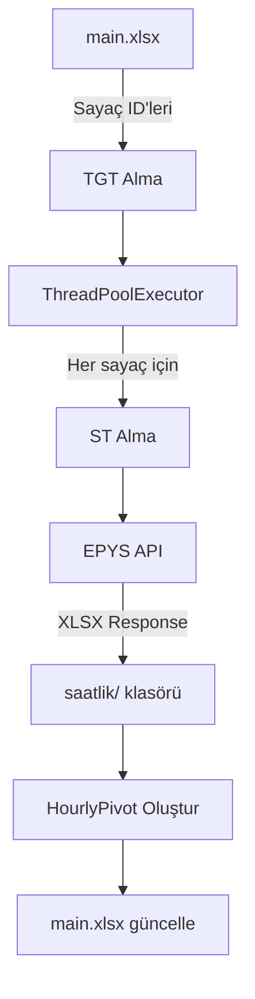

# 📊 EPYS Saatlik Sayaç Verisi Toplu İndirme Aracı

EPİAŞ EPYS API'sinden onaylı saatlik sayaç verilerini toplu olarak indiren, otomatik pivot raporu oluşturan ve gerçek zamanlı Excel entegrasyonu sağlayan Python uygulaması.

[](https://www.python.org/downloads/)
[](LICENSE)
[]()

---

## ✨ Özellikler

### 🎯 Temel Fonksiyonlar
- **Toplu Veri İndirme**: Excel listesindeki tüm sayaçları otomatik olarak indir
- **Paralel İşlem**: 20 eşzamanlı thread ile hızlı veri toplama
- **Otomatik Pivot Raporu**: HourlyPivot sayfası ile tüm sayaç verilerini tek bir görünümde incele
- **Akıllı Yeniden Deneme**: HTTP 500/502/503/504 hatalarında otomatik retry mekanizması
- **MWh → kWh Dönüşümü**: Verileri otomatik olarak kWh birimine çevirir

### 🔒 Güvenlik & Performans
- CAS TGT/ST authentication desteği
- Session yönetimi ve connection pooling
- Configurable retry stratejisi
- Timeout koruması (60 saniye)
- Thread-safe dosya operasyonları

### 📈 Raporlama
- **ControlFile**: İndirme durumu ve dosya yollarını içeren kontrol sayfası
- **HourlyPivot**: Tüm sayaçların saatlik verilerini yan yana görüntüleme

---

## 🚀 Hızlı Başlangıç

### Ön Gereksinimler

```bash
Python 3.7 veya üzeri
pip (Python paket yöneticisi)
```

### Kurulum

1. **Repoyu klonlayın**
```bash
git clone https://github.com/kullaniciadi/epys-meter-data-exporter.git
cd epys-meter-data-exporter
```

2. **Gerekli paketleri yükleyin**
```bash
pip install -r requirements.txt
```

3. **Kimlik bilgilerini ayarlayın**

`export_excel_realtime.py` dosyasını açın ve kimlik bilgilerinizi girin:

```python
USERNAME = "epias_kullanici_adi"
PASSWORD = "epias_sifre"
```

> [!WARNING]
> Kimlik bilgilerinizi asla GitHub'a commit etmeyin! `.gitignore` kullanın veya environment variables tercih edin.

---

## 📖 Kullanım

### 1️⃣ Excel Dosyasını Hazırlayın

`main.xlsx` dosyasında aşağıdaki sütunlardan birini oluşturun:
- **Meter ID** veya
- **SayacID**

Örnek:

| Meter ID |
|----------|
| 123456   |
| 789012   |
| 345678   |

### 2️⃣ Uygulamayı Çalıştırın

```bash
python export_excel_realtime.py
```

### 3️⃣ Çıktıları İnceleyin

**İndirilen dosyalar:**
```
saatlik/
├── onayli_sayac_123456.xlsx
├── onayli_sayac_789012.xlsx
└── onayli_sayac_345678.xlsx
```

**main.xlsx içinde oluşturulan sayfalar:**
- `ControlFile`: İndirme durumu kontrolü
- `HourlyPivot`: Konsolide saatlik veri raporu

---

## ⚙️ Yapılandırma

### Parametreler

`export_excel_realtime.py` içinde aşağıdaki değişkenleri düzenleyebilirsiniz:

```python
# Paralel thread sayısı (varsayılan: 20)
MAX_WORKERS = 20

# Çıktı klasörü
OUTPUT_DIR = "saatlik"

# Ana Excel dosyası
MAIN_FILE = "main.xlsx"

# Retry ayarları
retry = Retry(
    total=5,                              # Toplam deneme sayısı
    backoff_factor=1,                     # Bekleme süresi çarpanı
    status_forcelist=[500, 502, 503, 504] # Retry yapılacak HTTP kodları
)
```

### Veri Parametreleri

API çağrısında değiştirebileceğiniz parametreler:

```python
payload = {
    "period": "2025-12-01T00:00:00+03:00",     # Veri dönemi
    "version": "2025-12-01T00:00:00+03:00",    # Versiyon
    "isRetrospective": False,                   # Geriye dönük mü?
    "region": "TR1",                            # Bölge
    "organization": 6464,                       # Organizasyon ID
    "isLastVersion": False,                     # Son versiyon mu?
    "readStatus": True,                         # Okuma durumu
    "exportType": "XLSX",                       # Çıktı formatı
    "meterId": mid,                             # Sayaç ID
}
```

---

## 📋 requirements.txt

```txt
requests>=2.31.0
pandas>=2.0.0
openpyxl>=3.1.0
urllib3>=2.0.0
```

---

## 🔧 Teknik Detaylar

### Mimari



### İş Akışı

1. **Kimlik Doğrulama**
   - CAS sunucusundan TGT (Ticket Granting Ticket) alınır
   - Her istek için ST (Service Ticket) oluşturulur

2. **Paralel İndirme**
   - ThreadPoolExecutor ile eşzamanlı işlem
   - Her sayaç için bağımsız API çağrısı
   - Retry mekanizması ile hata toleransı

3. **Veri İşleme**
   - XLSX dosyaları `saatlik/` klasörüne kaydedilir
   - MWh değerleri kWh'e dönüştürülür
   - Pivot tablo oluşturulur

4. **Raporlama**
   - ControlFile: İndirme başarı/hata durumu
   - HourlyPivot: Konsolide saatlik veri görünümü

### API Endpoint

```
POST https://epys.epias.com.tr/pre-reconciliation/v1/meter-data/approved-meter-data/hourly/export
```

**Headers:**
- `Content-Type: application/json`
- `Accept: application/json`
- `TGT: {ticket_granting_ticket}`

**Query Parameters:**
- `ticket={service_ticket}`

---

## 🐛 Hata Giderme

### Sık Karşılaşılan Hatalar

#### ❌ TGT alınamadı

```
Exception: TGT alınamadı! Dönen header: ...
```

**Çözüm:** Kullanıcı adı ve şifrenizi kontrol edin.

---

#### ❌ Excel'de sütun bulunamadı

```
Exception: Excel'de 'Meter ID' veya 'SayacID' bulunamadı!
```

**Çözüm:** `main.xlsx` dosyasında **Meter ID** veya **SayacID** sütunu oluşturun.

---

#### ❌ XLSX içeriği gelmedi

```
Sayaç 123456: XLSX İçeriği gelmedi (404)
```

**Çözüm:** 
- Sayaç ID'sinin doğruluğunu kontrol edin
- Tarih ve versiyon parametrelerini gözden geçirin
- API erişim yetkilerinizi doğrulayın

---

#### ❌ Timeout hataları

**Çözüm:** 
- `MAX_WORKERS` değerini azaltın (örn: 10)
- İnternet bağlantınızı kontrol edin
- VPN veya proxy ayarlarınızı gözden geçirin

---

## 📊 Örnek Çıktı

### ControlFile Sayfası

| Meter ID | File Path                                  |
|----------|--------------------------------------------|
| 123456   | saatlik/onayli_sayac_123456.xlsx           |
| 789012   | saatlik/onayli_sayac_789012.xlsx           |
| 345678   | File Not Exists.                           |

### HourlyPivot Sayfası

| Saat | Sayaç ABC | Sayaç XYZ | Sayaç 123 |
|------|-----------|-----------|-----------|
| 1    | 1250.5    | 980.2     | 1100.0    |
| 2    | 1180.3    | 945.8     | 1050.5    |
| 3    | 1100.0    | 920.0     | 1025.0    |
| ...  | ...       | ...       | ...       |

---

## 🤝 Katkıda Bulunma

Katkılarınızı bekliyoruz! Lütfen şu adımları izleyin:

1. Fork yapın
2. Feature branch oluşturun (`git checkout -b feature/AmazingFeature`)
3. Değişikliklerinizi commit edin (`git commit -m 'Add some AmazingFeature'`)
4. Branch'inizi push edin (`git push origin feature/AmazingFeature`)
5. Pull Request açın

---

## 📝 Lisans

Bu proje MIT lisansı altında lisanslanmıştır. Detaylar için [LICENSE](LICENSE) dosyasına bakın.

---

## 👤 İletişim

Proje Sahibi - [@kullaniciadi](https://github.com/kullaniciadi)

Proje Linki: [https://github.com/kullaniciadi/epys-meter-data-exporter](https://github.com/kullaniciadi/epys-meter-data-exporter)

---

## 🙏 Teşekkürler

- [EPİAŞ](https://www.epias.com.tr/) - API sağlayıcısı
- [Requests](https://requests.readthedocs.io/) - HTTP kütüphanesi
- [Pandas](https://pandas.pydata.org/) - Veri analizi
- [OpenPyXL](https://openpyxl.readthedocs.io/) - Excel işlemleri

---

## ⭐ Beğendiyseniz Yıldız Verin!

Bu projeyi faydalı bulduysan GitHub'da ⭐ vermeyi unutma!

---

<div align="center">
  Made with ❤️ by Murat Demirbaş
  <br>
  <sub>Enerji sektörü için açık kaynak çözümler</sub>
</div>
